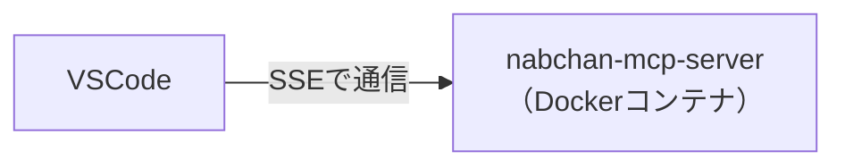
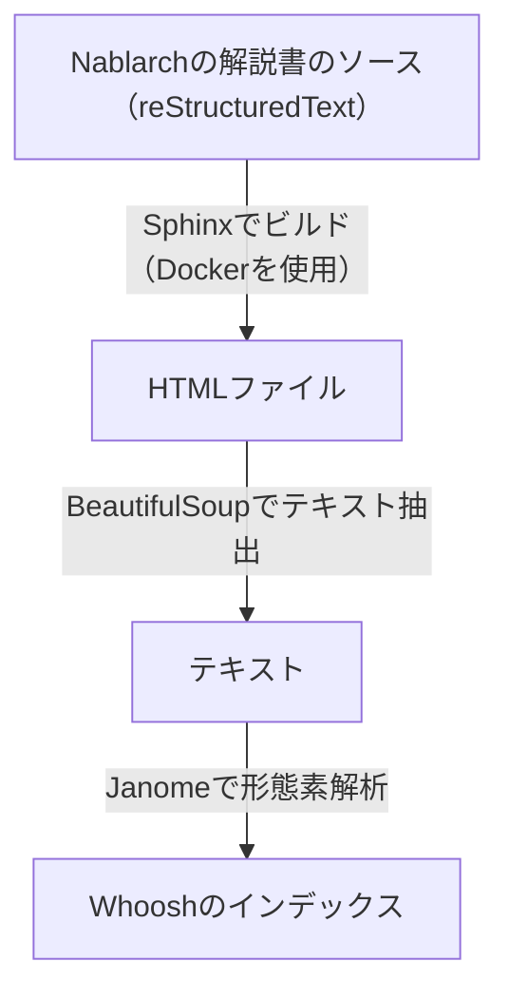

# nabchan-mcp-server

> [!WARNING]
> これは実験的なプロジェクトであり、改善の余地が大いにあります。

## 概要

[Nablarchの解説書](https://nablarch.github.io/docs/LATEST/doc/)をもとにしてNablarchの情報を返すMCPサーバーです。

## Getting started

Dockerを使って簡単に試せます。



次のコマンドでDockerコンテナを起動してください。

```bash
docker run -p 8000:8000 ghcr.io/backpaper0/nabchan-mcp-server
```

VSCodeへ次の設定を追加してください。

```json
{
  "mcp": {
    "inputs": [],
    "servers": {
      "nablarch-document": {
        "type": "sse",
        "url": "http://localhost:8000/sse"
      }
    }
  }
}
```

GitHub Copilot ChatをAgentモードにしてNablarchに関する質問をしてみてください。

## アーキテクチャ

とりあえずローカルのPythonだけで動作するような構成を取っています。

[Whoosh](https://sygil-dev.github.io/whoosh-reloaded/)という全文検索ライブラリと[Janome](https://janome.mocobeta.dev/ja/)という形態素解析ライブラリを使ってインデックスを構築しています。
インデックスは解説書のHTMLを元に作成されます。



MCPサーバーが提供しているAPIは次の通りです。

- `read_document`
    - URLが示すNablarchのドキュメントを返します。
- `search_document`
    - Nablarchのドキュメントを検索します。

## 必要な環境

- Python 3.11
- [uv](https://docs.astral.sh/uv/)
- Git
- Docker

## インデックスの構築手順

1. Nablarchの解説書を取得します
   ```bash
   git clone --depth=1 git@github.com:nablarch/nablarch-document.git
   ```
2. 解説書をビルドします
   ```bash
   docker build -t nablarch-document-build nablarch-document
   ```
   ```bash
   docker run --rm -v $PWD/nablarch-document:/root/document -w /root/document nablarch-document-build sphinx-build -d _build/.doctrees/ja -b html ja _build/html
   ```
3. 全文検索のインデックスを作成します
   ```bash
   uv run -m nabchan_mcp_server.build_index --nablarch_document_path=nablarch-document --index_path=index
   ```

## VSCodeの設定例

`/path/to/nabchan-mcp-server`は実際のパスに置き換えてください。

```json
{
  "mcp": {
    "inputs": [],
    "servers": {
      "nablarch-document": {
        "command": "uv",
        "args": [
          "--directory",
          "/path/to/nabchan-mcp-server",
          "run",
          "-m",
          "nabchan_mcp_server.main",
        ],
        "env": {}
      }
    }
  }
}
```

トランスポートタイプにSSEを使う場合はこちら。

```json
{
  "mcp": {
    "inputs": [],
    "servers": {
      "nablarch-document": {
        "type": "sse",
        "url": "http://localhost:8000/sse"
      }
    }
  }
}
```

SSEを使う場合は次のコマンドであらかじめサーバーを起動しておく必要があります。

```bash
uv run -m nabchan_mcp_server.main --transport sse
```

## コンテナイメージのビルドとデプロイ

インデックスを構築した状態で次のコマンドを実行してコンテナイメージをビルドします。

```bash
docker build -t nabchan-mcp-server .
```

コンテナイメージをGitHubのContainer registryへデプロイします。

- 参考: [コンテナレジストリの利用 - GitHub Docs](https://docs.github.com/ja/packages/working-with-a-github-packages-registry/working-with-the-container-registry)

```bash
echo $CR_PAT | docker login ghcr.io -u USERNAME --password-stdin
```

```bash
docker tag nabchan-mcp-server ghcr.io/backpaper0/nabchan-mcp-server:latest
```

```bash
docker push ghcr.io/backpaper0/nabchan-mcp-server:latest
```
