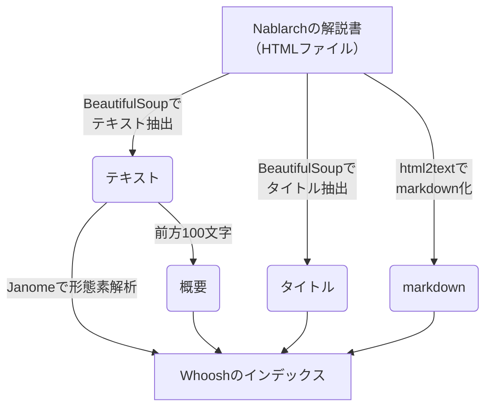

# nabchan-mcp-server

> [!WARNING]
> これは実験的なプロジェクトであり、改善の余地が大いにあります。

## 概要

[Nablarchの解説書](https://nablarch.github.io/docs/LATEST/doc/)をもとにしてNablarchの情報を返すMCPサーバーです。

## Getting started

Dockerを使って簡単に試せます。


次のコマンドでDockerコンテナを起動してください。

```bash
docker run -p 8000:8000 ghcr.io/backpaper0/nabchan-mcp-server
```

VSCodeへ次の設定を追加してください。

```json
{
  "mcp": {
    "inputs": [],
    "servers": {
      "nablarch-document": {
        "type": "sse",
        "url": "http://localhost:8000/sse"
      }
    }
  }
}
```

GitHub Copilot ChatをAgentモードにしてNablarchに関する質問をしてみてください。

## アーキテクチャ

とりあえずローカルのPythonだけで動作するような構成を取っています。

[Whoosh](https://sygil-dev.github.io/whoosh-reloaded/)という全文検索ライブラリと[Janome](https://janome.mocobeta.dev/ja/)という形態素解析ライブラリを使ってインデックスを構築しています。
解説書のHTMLから抽出したテキストを形態素解析したものが全文検索の対象フィールドとなります。
それ以外にもタイトルや概要、内容をmarkdown形式に変換したものをもっており、それらはMCPサーバーが提供するAPIで利用されます。



MCPサーバーが提供しているAPIは次の通りです。

- `read_document`
    - URLが示すNablarchのドキュメントをmarkdown形式へ変換したものを返します。
- `search_document`
    - Nablarchのドキュメントを検索します。返される情報は次の通り
        - タイトル
        - URL
        - 概要

## 必要な環境

- Python 3.11
- [uv](https://docs.astral.sh/uv/)
- Git
- Docker

## インデックスの構築

```bash
uv run -m tools.build_index
```

> [!NOTE]
> サブモジュールの中身を取得していない場合、`git submodule init`と`git submodule update`を実行してください。

### 検索を試す

```bash
uv run -m tools.search_document -q "Nablarch"
```

## VSCodeの設定例

`/path/to/nabchan-mcp-server`は実際のパスに置き換えてください。

```json
{
  "mcp": {
    "inputs": [],
    "servers": {
      "nablarch-document": {
        "command": "uv",
        "args": [
          "--directory",
          "/path/to/nabchan-mcp-server",
          "run",
          "-m",
          "nabchan_mcp_server.main",
        ],
        "env": {}
      }
    }
  }
}
```

トランスポートタイプにSSEを使う場合はこちら。

```json
{
  "mcp": {
    "inputs": [],
    "servers": {
      "nablarch-document": {
        "type": "sse",
        "url": "http://localhost:8000/sse"
      }
    }
  }
}
```

SSEを使う場合は次のコマンドであらかじめサーバーを起動しておく必要があります。

```bash
uv run -m nabchan_mcp_server.main --transport sse
```
